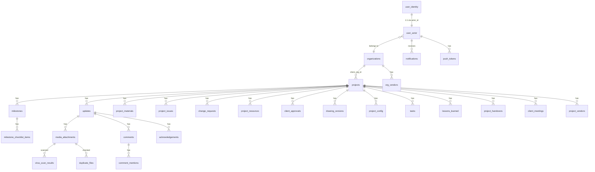

# Setuu Enterprise — Implementation Plan

## Goal

Build a **fully working Next.js web prototype** from 181 AI-generated Stitch design screens, connected to an existing Supabase database with 34 tables, serving 6 user roles with real authentication and role-based access control.

---

## Decisions Locked In

| Framework | **Next.js 14** (App Router) - *As requested for initial web prototype* |
| Platform | **Web first** (responsive) |
| Styling | **Tailwind CSS** (already used in designs) |
| Database | **Supabase** (updated 46-table/type schema) |
| Auth | **Supabase Auth** (email/password) |
| Build order | Admin → PM → Employee → Vendor → Client → SuperAdmin |
| Scope | Full feature set |
| Future Path | *Option A (Next.js) will be converted to Option B (Flutter) later, per user request.* |

---

## Database Schema Analysis

### Existing Tables (46 tables & enums)

The updated Supabase schema (`db_now.md`) perfectly matches the updated SRS and covers all core functionality. The gaps identified in the older schema have been resolved (e.g., `timesheets`, `invoices`, and `wiki_docs` have been added, and defects are handled via `project_issues`).



### Table-to-Screen Mapping

| Table | Screens That Use It | Role(s) |
|-------|-------------------|---------|
| `projects` | Executive Dashboard, Project Tracking Hub, PM Command Center, Engineer Workbench, Client Portfolio | All |
| `milestones` + `milestone_checklist_items` | Milestone & Task Management Hub, Mobile Milestone Checklist | Admin, PM |
| `updates` + `media_attachments` | Progress Feed, Camera-First Creator, Moderation Feed, Verified Progress Feed | PM, Admin, Client |
| `comments` + `comment_mentions` | Collaboration Hub, @Mentions screens | PM, Engineer |
| `acknowledgements` | Client Approvals Tracker, Verified Progress Feed | Client, Admin |
| `project_materials` | Master Material Tracking, Material PO & Delivery Hub, Material Receipt | Admin, PM, Vendor |
| `project_issues` | Issues & Blockers Console, Project Issues Logger | Admin, PM, Engineer |
| `change_requests` | Change Request Approval Queue, Draft Change Request Form, Financials Board | Admin, PM, Client |
| `project_resources` | Resource & Timesheet Hub, Allocation Analytics, Productivity Matrix | Admin, PM |
| `client_approvals` | Client Approvals Tracker, Financials Board | Admin, Client |
| `drawing_versions` | Drawing & Media Hub, Drawing Version Comparison, CAD Viewer, Mobile Annotations | Admin, PM, Engineer |
| `lessons_learned` | Lessons Learned Repository | Admin, PM |
| `project_handovers` | Handover & Compliance Vault, Project Handover Console | Admin, PM, Client |
| `client_meetings` | Client Meeting & Agenda Hub, Handover & Meeting Registry | Admin, PM, Client |
| `audit_log` | Audit Log Explorer, Organizational Audit Log | Admin, SuperAdmin |
| `project_config` | Project Module Flags & Controls, Project Configuration Hub | Admin |
| `support_tickets` | Support Ticket Triage, PM Help Desk, Global Support Triage | Admin, PM, SuperAdmin |
| `organizations` | Organization & Subscription Hub, Invite Org Admin | SuperAdmin, Admin |
| `subscription_tiers` | Super Admin Control Center, Subscription Hub | SuperAdmin |
| `platform_settings` | Platform Configuration Manager | SuperAdmin |
| `break_glass_logs` | Break-Glass Security Console, Break-Glass Log Review | SuperAdmin, Admin |
| `virus_scan_results` | ClamAV Dropzone States, Org Threat Dashboard | Admin |
| `duplicate_files` | Duplicate File Resolution Center | Admin |
| `tasks` | Task & Kanban Board, Multidisciplinary Task Checklist, Subcontracted Task Board | Engineer, PM, Vendor |
| `notifications` + `push_tokens` | Notification bell (all topbars) | All |
| `user_actor` + `user_identity` | User & Vendor Directory, Team Directory, Login/Profile | All |
| `org_vendors` + `project_vendors` | Vendor Management, Project Team Directory | Admin, PM, Vendor |
| `project_reports` | Reporting & Export Engine, Automated Reporting | Admin, PM |

### Schema Completeness

> [!SUCCESS]
> The updated `db_now.md` schema successfully resolves all previous database gaps!
> - **Timesheets & Labor**: Now supported via the `timesheets` table.
> - **Vendor Invoicing**: Now supported via the `invoices` table.
> - **Team Wiki/Docs**: Now supported via the `wiki_docs` table.
> - **Defects & Rework**: Handled natively within `project_issues` via specific categories, as detailed in the new SRS.
> - **Deliveries & Logistics**: Supported via `project_materials` (`tracking_timeline`, `vendor_id`, `actual_delivery`).
>
> **No additional tables need to be created for the MVP.** We can proceed directly with the existing schema.

### Enums (Existing)

| Enum | Values |
|------|--------|
| `project_type` | Mechanical, Electrical, Software, Combined |
| `project_status` | Not Started, In Progress, On Hold, Completed, Delivered |
| `department_type` | Mechanical, Electrical, Software, General |
| `media_type` | image, video, document |
| `ack_status` | Acknowledged, Needs Discussion |
| `notification_type` | update, comment, mention, project, system |

### RLS Architecture Summary

The existing RLS policies follow a clean hierarchy:

| Role | Access Pattern |
|------|---------------|
| `super_admin` | Full platform read + platform_settings/subscription/break_glass write |
| `admin` | Full org read/write + all project CRUD + audit log read |
| `pm` | Assigned project CRUD + milestone/task/resource management |
| `employee` | All project read + own update/comment CRUD + timesheets |
| `client` | Org project read + acknowledgement CRUD + own approval actions |
| `vendor` | Assigned project/material read + own task status update + delivery proof upload + invoices |

---

## Proposed Architecture

### Project Structure

```
setuu-prototype/
├── src/
│   ├── app/
│   │   ├── (auth)/
│   │   │   ├── login/page.tsx
│   │   │   ├── signup/page.tsx
│   │   │   └── layout.tsx
│   │   ├── (dashboard)/
│   │   │   ├── layout.tsx                    # Role-aware shell (sidebar + topbar)
│   │   │   ├── page.tsx                      # Role-based redirect
│   │   │   ├── admin/
│   │   │   │   ├── page.tsx                  # Executive Dashboard
│   │   │   │   ├── projects/
│   │   │   │   │   ├── page.tsx              # Project Tracking Hub
│   │   │   │   │   ├── new/page.tsx          # Project Creation Wizard
│   │   │   │   │   └── [id]/
│   │   │   │   │       ├── page.tsx          # Project Detail
│   │   │   │   │       ├── milestones/page.tsx
│   │   │   │   │       ├── materials/page.tsx
│   │   │   │   │       ├── drawings/page.tsx
│   │   │   │   │       ├── issues/page.tsx
│   │   │   │   │       ├── changes/page.tsx
│   │   │   │   │       ├── resources/page.tsx
│   │   │   │   │       ├── timeline/page.tsx
│   │   │   │   │       ├── config/page.tsx
│   │   │   │   │       └── handover/page.tsx
│   │   │   │   ├── users/page.tsx            # User & Vendor Directory
│   │   │   │   ├── vendors/
│   │   │   │   │   ├── page.tsx              # Vendor Directory
│   │   │   │   │   └── performance/page.tsx  # Vendor Performance Audit
│   │   │   │   ├── clients/
│   │   │   │   │   ├── onboarding/page.tsx   # Client Onboarding Wizard
│   │   │   │   │   └── approvals/page.tsx    # Client Approvals Tracker
│   │   │   │   ├── reports/page.tsx          # Automated Reporting Engine
│   │   │   │   ├── audit/page.tsx            # Organizational Audit Log
│   │   │   │   ├── support/page.tsx          # Support Ticket Triage
│   │   │   │   ├── broadcasts/page.tsx       # Bulk Notification Center
│   │   │   │   ├── archive/page.tsx          # Archive & Data Retention
│   │   │   │   ├── security/
│   │   │   │   │   ├── threats/page.tsx      # Org Threat Dashboard
│   │   │   │   │   └── duplicates/page.tsx   # Duplicate File Resolution
│   │   │   │   └── settings/page.tsx         # Admin Settings & Org Config
│   │   │   ├── pm/
│   │   │   │   ├── page.tsx                  # PM Command Center
│   │   │   │   ├── projects/[id]/
│   │   │   │   │   ├── milestones/page.tsx
│   │   │   │   │   ├── drawings/page.tsx
│   │   │   │   │   ├── materials/page.tsx
│   │   │   │   │   ├── changes/page.tsx
│   │   │   │   │   ├── resources/page.tsx
│   │   │   │   │   ├── collaboration/page.tsx
│   │   │   │   │   ├── timeline/page.tsx
│   │   │   │   │   ├── issues/page.tsx
│   │   │   │   │   ├── lessons/page.tsx
│   │   │   │   │   └── handover/page.tsx
│   │   │   │   ├── team/page.tsx
│   │   │   │   ├── reports/page.tsx
│   │   │   │   ├── support/page.tsx
│   │   │   │   └── sync/page.tsx             # Offline Sync Queue
│   │   │   ├── engineer/
│   │   │   │   ├── page.tsx                  # Master Workbench
│   │   │   │   ├── tasks/page.tsx            # Kanban Board
│   │   │   │   ├── assets/page.tsx           # Engineering Asset Hub
│   │   │   │   ├── reviews/page.tsx          # Peer Review Queue
│   │   │   │   ├── issues/page.tsx           # Issue Console
│   │   │   │   ├── timesheets/page.tsx       # Timesheet Logger
│   │   │   │   ├── collaboration/page.tsx
│   │   │   │   ├── docs/page.tsx             # Team Wiki
│   │   │   │   └── settings/page.tsx         # Preferences
│   │   │   ├── vendor/
│   │   │   │   ├── page.tsx                  # Dispatch Dashboard
│   │   │   │   ├── deliveries/page.tsx       # Material PO Hub
│   │   │   │   ├── proof/page.tsx            # Delivery Proof Upload
│   │   │   │   ├── tasks/page.tsx            # Subcontracted Tasks
│   │   │   │   ├── defects/page.tsx          # Defect Remediation
│   │   │   │   └── invoices/page.tsx         # Invoicing & Payments
│   │   │   ├── client/
│   │   │   │   ├── page.tsx                  # Portfolio Dashboard
│   │   │   │   ├── briefing/[id]/page.tsx    # Project Briefing Hub
│   │   │   │   ├── financials/page.tsx       # Financials & Change Requests
│   │   │   │   ├── deliverables/page.tsx     # Asset Room
│   │   │   │   ├── progress/page.tsx         # Verified Progress Feed
│   │   │   │   ├── meetings/page.tsx         # Meeting & Agenda Hub
│   │   │   │   └── vault/page.tsx            # Handover Vault
│   │   │   └── superadmin/
│   │   │       ├── page.tsx                  # Control Center
│   │   │       ├── infrastructure/page.tsx
│   │   │       ├── organizations/page.tsx    # Org & Subscription Hub
│   │   │       ├── storage/page.tsx          # Storage Monitoring
│   │   │       ├── security/page.tsx         # Break-Glass Console
│   │   │       ├── audit/page.tsx            # Audit Log Explorer
│   │   │       ├── support/page.tsx          # Global Ticket Triage
│   │   │       └── config/page.tsx           # Platform Configuration
│   │   ├── layout.tsx                        # Root layout
│   │   └── page.tsx                          # Landing → redirect
│   │
│   ├── components/
│   │   ├── ui/                               # Design system primitives
│   │   │   ├── button.tsx
│   │   │   ├── badge.tsx                     # Semantic status badges
│   │   │   ├── card.tsx                      # L1 elevation card
│   │   │   ├── table.tsx                     # Data-dense tables
│   │   │   ├── modal.tsx                     # L3 modals
│   │   │   ├── input.tsx
│   │   │   ├── select.tsx
│   │   │   ├── tabs.tsx
│   │   │   ├── progress-bar.tsx              # Storage quotas, project progress
│   │   │   ├── avatar.tsx
│   │   │   ├── dropdown.tsx
│   │   │   ├── file-upload.tsx               # Dropzone with scan states
│   │   │   ├── search.tsx
│   │   │   └── toast.tsx
│   │   ├── navigation/
│   │   │   ├── sidebar.tsx                   # 280px desktop sidebar
│   │   │   ├── topbar.tsx                    # Glassmorphic top bar
│   │   │   ├── bottom-nav.tsx                # Mobile bottom navigation
│   │   │   ├── breadcrumbs.tsx
│   │   │   └── nav-config.ts                 # Per-role nav items
│   │   ├── dashboard/
│   │   │   ├── kpi-card.tsx                  # Metric cards
│   │   │   ├── activity-feed.tsx             # Timeline/feed pattern
│   │   │   ├── status-chip.tsx               # 8-tone semantic chips
│   │   │   └── sync-banner.tsx               # Offline sync indicator
│   │   ├── project/
│   │   │   ├── project-card.tsx
│   │   │   ├── milestone-list.tsx
│   │   │   ├── checklist.tsx
│   │   │   ├── drawing-viewer.tsx            # Dark inverse viewport
│   │   │   ├── material-table.tsx
│   │   │   ├── issue-card.tsx
│   │   │   ├── change-request-form.tsx
│   │   │   └── timeline-entry.tsx
│   │   └── security/
│   │       ├── break-glass-banner.tsx        # Crimson pulsating border
│   │       ├── clamav-dropzone.tsx            # Upload with scan states
│   │       └── force-logout-modal.tsx
│   │
│   ├── lib/
│   │   ├── supabase/
│   │   │   ├── client.ts                     # Browser client
│   │   │   ├── server.ts                     # Server client
│   │   │   ├── middleware.ts                 # Auth middleware
│   │   │   └── queries/                      # Per-table query functions
│   │   │       ├── projects.ts
│   │   │       ├── milestones.ts
│   │   │       ├── updates.ts
│   │   │       ├── materials.ts
│   │   │       ├── issues.ts
│   │   │       ├── users.ts
│   │   │       └── ... (one per domain)
│   │   ├── auth/
│   │   │   ├── context.tsx                   # AuthProvider + UserContext
│   │   │   ├── guards.tsx                    # Role-based route guards
│   │   │   └── hooks.ts                      # useUser, useRole, usePermissions
│   │   ├── constants/
│   │   │   ├── roles.ts                      # Role enum + permissions map
│   │   │   ├── statuses.ts                   # Status enum + semantic color map
│   │   │   └── nav-items.ts                  # Per-role navigation configs
│   │   └── utils/
│   │       ├── format.ts                     # Date, currency, GPS formatters
│   │       └── cn.ts                         # className merger (clsx + twMerge)
│   │
│   ├── styles/
│   │   └── globals.css                       # Design tokens as CSS vars + Tailwind
│   │
│   └── types/
│       ├── database.ts                       # Auto-generated Supabase types
│       ├── roles.ts                          # Role type definitions
│       └── enums.ts                          # project_status, ack_status, etc.
│
├── public/
│   └── fonts/                                # Self-hosted fonts (fallback)
├── tailwind.config.ts                        # Design system tokens
├── next.config.js
├── package.json
├── tsconfig.json
└── .env.local                                # SUPABASE_URL, SUPABASE_ANON_KEY
```

### Design Token System (globals.css)

```css
/* Light theme (default) */
:root {
  /* Surface tokens from desktop-design-light.md */
  --surface: #faf9f4;
  --surface-dim: #dbdad5;
  --surface-bright: #faf9f4;
  --surface-container-lowest: #ffffff;
  --surface-container-low: #f5f4ef;
  --surface-container: #efeee9;
  --surface-container-high: #e9e8e3;
  --surface-container-highest: #e3e3de;
  --on-surface: #1b1c19;
  --on-surface-variant: #43474d;
  --outline: #73777e;
  --outline-variant: #c3c6ce;
  /* Primary */
  --primary: #000815;
  --on-primary: #ffffff;
  --primary-container: #00213c;
  --secondary: #00658d;
  --on-secondary: #ffffff;
  --secondary-container: #8ad1ff;
  /* Error */
  --error: #ba1a1a;
  --error-container: #ffdad6;
  /* Semantic workflow (shared) */
  --status-neutral: #64748b;
  --status-active: #0284c7;
  --status-warning: #d97706;
  --status-success: #16a34a;
  --status-finalization: #0d9488;
  --status-verification: #2563eb;
  --status-attention: #9333ea;
  --status-emergency: #dc2626;
  /* Glass */
  --glass-bg: rgba(255, 255, 255, 0.85);
  --glass-border: rgba(255, 255, 255, 0.5);
}

/* Dark theme from desktop-design-dark.md */
.dark {
  --surface: #121411;
  --surface-dim: #121411;
  --surface-bright: #383a36;
  --surface-container-lowest: #0d0f0c;
  --surface-container-low: #1b1c19;
  --surface-container: #1f201d;
  --surface-container-high: #292a27;
  --surface-container-highest: #343532;
  --on-surface: #e3e3de;
  --on-surface-variant: #c3c6ce;
  --outline: #8d9198;
  --outline-variant: #43474d;
  --primary: #aec9eb;
  --on-primary: #15324e;
  --primary-container: #00213c;
  --secondary: #88cffc;
  --on-secondary: #00344b;
  --secondary-container: #00658d;
  --error: #ffb4ab;
  --error-container: #93000a;
  --glass-bg: rgba(18, 26, 33, 0.85);
  --glass-border: rgba(65, 190, 253, 0.2);
}
```

---

## Build Phases

### Phase 0 — Foundation (Week 1)
> Project scaffolding, design system, auth, shared components

#### [NEW] Next.js project setup
- `npx create-next-app@latest` with App Router, TypeScript, Tailwind
- Supabase client libraries (`@supabase/supabase-js`, `@supabase/ssr`)
- Configure `tailwind.config.ts` with full design token system
- Create `globals.css` with light/dark CSS custom properties
- Self-host Merriweather, Inter, JetBrains Mono via `next/font`

#### [NEW] Supabase Auth integration
- Login page with email/password
- Signup page with role assignment
- Auth middleware for route protection
- `AuthProvider` context with `useUser()` / `useRole()` hooks
- Role-based redirect on login (admin → `/admin`, pm → `/pm`, etc.)

#### [NEW] Shared UI components (extracted from design patterns)
- `Sidebar` — 280px, deep navy, role-configurable nav items
- `Topbar` — Glassmorphic, search, notifications, user avatar
- `KPICard` — Metric display with trend indicator
- `StatusBadge` — 8-tone semantic chip system
- `DataTable` — Sortable, with JetBrains Mono metadata columns
- `Card` — L1 elevation with hover shadow
- `Modal` — L3 overlay with backdrop
- `FileUpload` — Dropzone with scan state indicators
- `SyncBanner` — Amber offline / Blue syncing / Green connected
- `ActivityFeed` — Timeline entry pattern

#### [NEW] Create missing database tables
- Run migration SQL for the 12 missing tables listed above
- Generate TypeScript types from Supabase schema

---

### Phase 1 — Admin Role (Weeks 2-3)
> 41 desktop + 25 mobile screens = 66 screens (largest role)

#### Screens to build (grouped by domain):

**Dashboard & Overview**
- Executive Admin Dashboard (KPI cards, regional map, activity stream)
- Project Tracking Hub (portfolio table with status filters)

**Project Management**
- Project Creation Wizard (multi-step form)
- Project Configuration Hub (settings, metadata)
- Project Module Flags & Controls (feature toggles per project)

**Assets & Materials**
- Master Material Tracking (procurement table with vendor data)
- Drawing & Media Hub (file browser with version history)
- Drawing Version Comparison (diff viewer)

**People & Vendors**
- User & Vendor Directory (searchable user table)
- Vendor Performance Audit (scorecard dashboard)
- Client Onboarding Wizard (multi-step form)
- Client Approvals Tracker (sign-off status table)

**Operations**
- Project Issues & Blockers Console (issue table with severity)
- Change Request Approval Queue (approval workflow)
- Resource & Timesheet Management Hub (labor hours table)
- Advanced Resource Allocation Analytics (charts)

**Communication & Compliance**
- Bulk Notification & Broadcast Center (message composer)
- Progress Update Moderation Feed (content validation)
- Organizational Audit Log (immutable event table)
- Automated Reporting Engine (report config)

**Administration**
- Admin Settings & Org Configuration (policy settings)
- Archive & Data Retention Manager (lifecycle management)
- Support Ticket Triage (help desk table)

**Security**
- Org Threat & Virus Scan Dashboard (ClamAV results)
- Duplicate File Resolution Center (side-by-side comparison)
- ClamAV Upload Dropzone States (upload component showcase)
- Force Logout Security Modal (session termination)

---

### Phase 2 — Project Manager Role (Weeks 4-5)
> 24 desktop + 10 mobile = 34 screens

We will tackle Phase 2 in a smaller, focused slice to ensure high quality before moving to the rest.

#### Phase 2a: PM Core (Current Focus)
This slice focuses on the fundamental tools a Project Manager needs day-to-day.

#### [NEW] `src/app/dashboard/pm/page.tsx`
- **PM Project Dashboard & Command Center:** The main entry point for the PM. It will display a rollup of all their assigned projects, highlighting critical tasks, recent updates, and upcoming milestones.

#### [NEW] `src/app/dashboard/pm/projects/[id]/layout.tsx`
- **Project Context Shell:** A sub-layout that adds a project-specific navigation tab bar (Milestones, Materials, Timeline, etc.) below the main topbar, keeping the PM oriented within a specific project context.

#### [NEW] `src/app/dashboard/pm/projects/[id]/milestones/page.tsx`
- **Milestone & Task Management Hub:** A master-detail view where PMs can see the project's milestones, expand them to see underlying tasks (checklists), and update statuses.

#### [NEW] `src/app/dashboard/pm/projects/[id]/materials/page.tsx`
- **Project Materials Log & Tracking:** A tabular ledger of all materials ordered for the project, their delivery status, vendor information, and PO numbers.

#### [NEW] `src/app/dashboard/pm/projects/[id]/timeline/page.tsx`
- **Project Timeline & Progress Feed:** A chronological narrative feed of updates, media attachments, and critical events related to the project.

**Dashboard**
- PM Project Dashboard & Command Center

**Core Workflows**
- Milestone & Task Management Hub (master-detail with checklists)
- Fullscreen Drawing & Media Hub (dark inverse viewport)
- Project Materials Log & Tracking
- Change Requests & Client Approvals Hub
- Resource Allocation & Productivity Matrix

**Field Operations**
- Camera-First Progress Update Creator (GPS-watermarked capture)
- Project Issues Logger (field form)
- Mobile Material Receipt & Verification
- Mobile Milestone & Task Checklist

**Collaboration**
- Project Collaboration Hub (threaded discussion)
- Handovers & Client Meetings Hub
- Lessons Learned Repository

**Utilities**
- Project Timeline & Progress Feed (narrative timeline)
- PM Reporting & Export Engine
- PM Support & Help Desk Portal
- Offline Sync Queue Manager
- Draft Change Request Form

---

### Phase 3 — Employee Role (Weeks 5-6)
> 12 desktop + 11 mobile = 23 screens

- Engineer's Master Workbench (sprint dashboard)
- Multidisciplinary Task & Kanban Board (drag-and-drop)
- Engineering Asset Hub / CAD Viewer (dark inverse viewport)
- Peer Review & Design Approvals (review queue)
- Issue, Bug & Blocker Console (telemetry table)
- Labor & Timesheet Logging Console
- Collaboration Hub & @Mentions
- Engineering Team Docs & Wiki (read-only SOPs)
- Employee Preferences & Integrations
- Mobile Log Peek (terminal log stream)

---

### Phase 4 — Vendor Role (Weeks 6-7)
> 7 desktop + 10 mobile = 17 screens

- Vendor Dispatch Dashboard (KPI stack)
- Material PO & Delivery Logistics Hub (transactional ledger)
- Delivery Proof Upload Dropzone (secure media upload)
- Subcontracted Task Execution Board (scoped Kanban)
- Defect & Rework Remediation Console (rejection feed)
- Vendor Invoicing & Payment Tracking (financial ledger)
- Driver Delivery Capture (camera-first mobile flow)

---

### Phase 5 — Client Role (Weeks 7-8)
> 7 desktop + 11 mobile = 18 screens

- Global Executive Portfolio Dashboard (capital overview)
- Project Briefing & Transparency Hub
- Financials, Billing & Change Request Board (sign-off portal)
- Asset & Deliverables Presentation Room (read-only gallery)
- Verified Progress & Site Update Feed (narrative timeline)
- Client Meeting & Agenda Hub (decision repository)
- Handover & Compliance Vault (warranty/compliance vault)
- Client Portal Initial Configuration State

---

### Phase 6 — Super Admin Role (Week 8)
> 16 desktop + 7 mobile = 23 screens

- Super Admin Control Center (system health)
- Infrastructure Command Dashboard (node topology)
- Organization & Subscription Hub (multi-tenant provisioning)
- Global Storage Monitoring Dashboard (quota analytics)
- Break-Glass Security Console (emergency RLS override)
- Break-Glass Log Review (forensic audit trail)
- Audit Log Explorer (system-wide event trail)
- Global Support & Ticket Triage
- Invite Organization Admin
- Platform Configuration Manager

---

## Open Questions

> [!WARNING]
> **Platform Discrepancy**: You previously decided to "start with option a" (Next.js Web Prototype) and later convert to Flutter. However, the updated `srs_updated.md` and `setuu_architecture_updated.md` you just provided are strictly written for a **Flutter Android App**. 
> **Question**: Should we still build the Next.js Web Prototype first, or should we switch gears and build the native Flutter app immediately as per the updated docs?

> [!IMPORTANT]
> **Supabase Project Credentials**: I'll need the Supabase project URL and anon key to connect. Do you want me to create a new Supabase project or use the existing one?

> [!IMPORTANT]
> **Seed Data**: Should I create realistic seed data for the prototype (sample projects, users per role, materials, etc.) or will you provide data from the existing database?

---

## Verification Plan

### Automated Tests
- `npm run build` — Ensure zero build errors after each phase
- `npm run lint` — ESLint + TypeScript strict mode
- Supabase type generation: `npx supabase gen types typescript`

### Manual Verification
- Each role's login → dashboard → navigation flow tested
- All CRUD operations verified against Supabase (create, read, update, delete)
- Light/dark mode toggle tested on every page
- Responsive layout tested at mobile (375px), tablet (768px), desktop (1440px)
- Role-based access: Verify users cannot access routes outside their role
