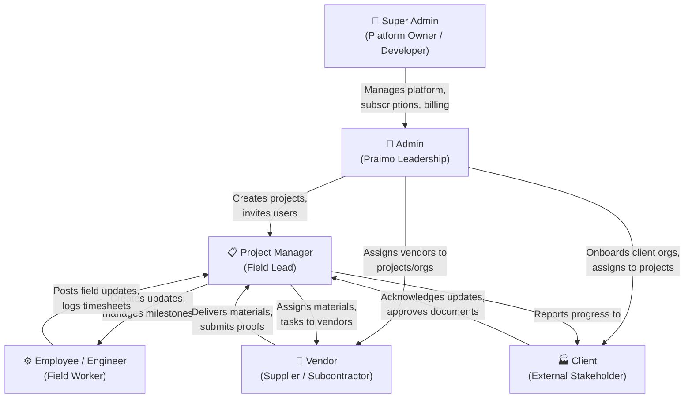
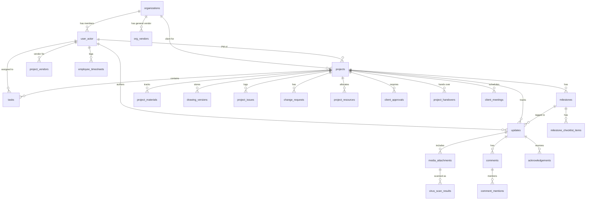

# Setuu Enterprise — Complete System Analysis

> **Date**: August 17, 2026 | **Source**: Deep analysis of 181 HTML screens, 183 PNG previews, 7 design specs, 30+ database tables, and the entire setuu-prototype codebase.

---

## 1. What is Setuu?

**Setuu** (Seamless Engineering Tracking & User Updates) is a **B2B construction/industrial project management platform** built by Praimo Innovation. It manages the full lifecycle of engineering projects — from project creation, blueprints, field progress tracking, materials procurement, vendor management, through to client reporting, handover, and compliance.

### Core Value Proposition
Setuu bridges the gap between **field workers on construction sites** (often with poor connectivity) and **corporate stakeholders** (clients like Rieter, Hitachi, Halliburton) who need real-time, auditable visibility into project progress. It replaces WhatsApp groups, email chains, and spreadsheets with a structured, permission-controlled platform.

---

## 2. The Six User Roles & Their Relationships

### Role Access Matrix

| Capability | Super Admin | Admin | PM | Employee | Vendor | Client |
|---|:-:|:-:|:-:|:-:|:-:|:-:|
| View projects | ❌ | All | Assigned | Assigned | Assigned | Org only |
| Create projects | ❌ | ✅ | ❌ | ❌ | ❌ | ❌ |
| View contract values | ❌ | ✅ | ❌ | ❌ | ❌ | ❌ |
| Upload progress updates | ❌ | ✅ | Assigned | Assigned | Own scope | ❌ |
| View updates | ❌ (Privacy) | ✅ | Assigned | Assigned | Own only | Org only |
| Acknowledge updates | ❌ | ✅ | ❌ | ❌ | ❌ | ✅ |
| Manage drawings & modules | ❌ | ✅ | Assigned | ❌ | ❌ | ❌ |
| Manage users/orgs | Billing only | ✅ | ❌ | ❌ | ❌ | ❌ |
| View audit logs | System only | ✅ | ❌ | ❌ | ❌ | ❌ |
| Update assigned materials | ❌ | ✅ | ✅ | ❌ | ✅ | ❌ |
| Log timesheets & wiki | ❌ | ✅ | ✅ | ✅ | ❌ | ❌ |
| Manage invoices | ❌ | ✅ | ✅ | ❌ | ✅ | ❌ |

> [!IMPORTANT]
> **Super Admin privacy boundary**: Super Admins manage platform infrastructure (subscriptions, storage quotas, system health) but are strictly prohibited from viewing organizational data, project content, or confidential files. This is a fundamental architectural constraint.

---

## 3. Screen Inventory Per Role

| Role | Desktop Screens | Mobile Screens | Total | Primary Function |
|---|:-:|:-:|:-:|---|
| **Super Admin** | 16 | 7 | **23** | Platform governance, multi-tenant monitoring, security |
| **Admin** | 41 | 25 | **66** | Strategic oversight, project lifecycle, vendor management |
| **Project Manager** | 24 | 10 | **34** | Field execution, milestones, materials, collaboration |
| **Employee/Engineer** | 12 | 11 | **23** | Technical tasks, CAD review, timesheets |
| **Vendor** | 7 | 10 | **17** | Supply chain, deliveries, invoicing, defect remediation |
| **Client** | 7 | 11 | **18** | Executive briefing, approvals, progress monitoring |
| **Total** | **107** | **74** | **181** | |

---

## 4. Design System — Complete Specification

### 4.1 Dual-Theme Philosophy

| Aspect | Light Mode ("Canvas & Sheet") | Dark Mode ("CAD Blueprint") |
|---|---|---|
| **Metaphor** | Architectural drawing on paper | Terminal / IDE readout |
| **Canvas** | Warm off-white `#FAF9F4` | Deep charcoal `#121411` |
| **Cards** | Pure white `#FFFFFF`, `#E0E0E0` borders | Dark `#1F201D`, `#334155` borders |
| **Primary** | Deep Praimo Blue `#00213C` | Neon Precision Cyan `#41BEFD` |
| **Semantic fills** | Full saturation backgrounds | 15% opacity glow fills |
| **Target users** | Field workers in sunlight | PMs in low-light / architectural environments |

### 4.2 Color Token System (Material 3)

| Token | Light | Dark | Purpose |
|---|---|---|---|
| `surface` | `#FAF9F4` | `#121411` | Canvas base |
| `on-surface` | `#1B1C19` | `#E3E3DE` | Primary text |
| `primary` | `#000815` | `#AEC9EB` | Primary actions |
| `primary-container` | `#00213C` | `#00213C` | Sidebar (shared) |
| `secondary` | `#00658D` | `#88CFFC` | Secondary actions |
| `error` | `#BA1A1A` | `#FFB4AB` | Error states |
| `outline` | `#73777E` | `#8D9198` | Borders |

### 4.3 Semantic Workflow Colors (8-Tone)

| Status | Color | Hex | DB Mapping |
|---|---|---|---|
| Neutral/Queue | Slate | `#64748B` | `Not Started`, Draft |
| Active | Sky Blue | `#0284C7` | `In Progress`, Syncing |
| Warning | Amber | `#D97706` | `On Hold`, Offline |
| Success | Emerald | `#16A34A` | `Completed`, Clean scan |
| Finalization | Teal | `#0D9488` | `Delivered`, Warranty |
| Verification | Royal Blue | `#2563EB` | `Acknowledged`, Approved |
| Attention | Purple | `#9333EA` | `Needs Discussion` |
| Emergency | Crimson | `#DC2626` | Critical issue, Break-Glass |

### 4.4 Typography — Tri-Font System

| Layer | Font | Purpose |
|---|---|---|
| Executive | **Merriweather** (Serif) | Dashboard titles, PDF reports, formal headers |
| Operational | **Inter** (Sans-Serif) | Tables, forms, body text, comments |
| Technical | **JetBrains Mono** (Monospace) | Timestamps, GPS coords, file hashes, audit logs |

### 4.5 Layout System

| Breakpoint | Columns | Margins | Navigation |
|---|:-:|:-:|---|
| Mobile (<640px) | 4 | 16px | Glassmorphic bottom nav (4-5 tabs) |
| Tablet (640-1024px) | 8 | 24px | Collapsible 72px rail |
| Desktop (>1024px) | 12 | 32px | Persistent 280px sidebar |

### 4.6 Elevation System

| Level | Description | Light | Dark |
|---|---|---|---|
| L0 | Canvas | `#FAF9F4` flat | `#121411` flat |
| L1 | Card | White, 8px radius, 1px border | Navy surface, subtle border |
| L2 | Glass | `rgba(255,255,255,0.85)` + 12px blur | `rgba(18,26,33,0.85)` + cyan edge + 12px blur |
| L3 | Modal | Blue-tinted shadow + 40% backdrop | Black shadow + 40% backdrop |

---

## 5. Screen Architecture Per Role

### 5.1 Super Admin — Platform Governance

| Screen | Purpose | Key Data |
|---|---|---|
| Control Center | Real-time system health dashboard | API uptime, active users, error rates |
| Infrastructure Command | Node topology, regional metrics | Server status, response times |
| Organization & Subscription Hub | Multi-tenant provisioning | Org list, tiers, storage quotas |
| Global Storage Monitoring | Quota analytics per org | Storage usage bars, pressure indicators |
| Break-Glass Security Console | Emergency RLS override | Crimson pulsating border, reason input |
| Break-Glass Log Review | Forensic audit trail | JetBrains Mono terminal-style grid |
| Audit Log Explorer | System-wide event trail | Timestamped JSONB diffs |
| Global Support & Ticket Triage | Platform-wide incidents | Priority badges, resolution notes |
| Invite Org Admin | Provision new organization | Subscription tier selection |
| Platform Config Manager | Maintenance mode, min app version | Toggle switches, version enforcement |

### 5.2 Admin — Organizational Command Center (66 Screens)

**Key Screens:**
- **Executive Dashboard**: Financial KPIs (contract values, CapEx), portfolio health, activity stream
- **Project Tracking Hub**: Active projects directory with status, PM, dates, milestones
- **Project Creation Wizard**: Multi-step flow (Master Data → Assignments → Config)
- **User & Vendor Directory**: Searchable/filterable user grid with role, org, status
- **Drawing & Media Hub**: Asset repository with version comparison (diff engine)
- **Master Material Tracking**: Procurement oversight with PO numbers, delivery dates
- **Change Request Approval Queue**: Variation management with cost/time impact analysis
- **Resource & Timesheet Hub**: Labor productivity matrix, allocated vs actual hours
- **Vendor Performance Audit**: Compliance scorecards, on-time %, avg delay
- **Client Onboarding Wizard**: Multi-step org setup flow (Profile → Subscription → Contact → Review)
- **Organizational Audit Log**: 12K+ events, immutable JSONB diffs, IP tracking
- **Archive & Data Retention**: Compliance-driven lifecycle management
- **ClamAV Upload Dropzone States**: Scanning → Clean/Infected visual states
- **Force Logout Security Modal**: Emergency session termination
- **Progress Update Moderation Feed**: Content validation before client visibility
- **Duplicate File Resolution**: Side-by-side comparison, merge/keep/purge
- **Virus Scan Dashboard**: File security threat monitoring
- **Automated Reporting Engine**: PDF report generation & scheduling
- **Bulk Notification Center**: Organization-wide broadcast tool

### 5.3 Project Manager — Field Execution

**Key Screens:**
- **PM Command Center**: Portfolio overview, active projects, pending tasks
- **Milestone & Task Management Hub**: Nested checklists, Kanban board, drag-reorder
- **Fullscreen Drawing Hub**: Anti-glare dark viewport, glassmorphic markup toolbar, version history
- **Camera-First Update Creator**: GPS-watermarked photo/video capture, direct-to-feed
- **Project Issues Logger**: Rapid defect entry with severity, root cause
- **Material Receipt & Verification**: QR scan, delivery proof upload
- **Collaboration Hub & @Mentions**: Threaded discussion with attachment support
- **Labor & Timesheet Logger**: Weekly matrix, submit/approve flow
- **Offline Sync Queue Manager**: Queued items with amber borders, retry/sync status
- **Draft Change Request Form**: Variation drafting with cost/time impact fields
- **Project Timeline Feed**: Narrative progress updates with media

### 5.4 Employee/Engineer — Technical Execution

**Key Screens:**
- **Master Workbench**: Daily sprint overview, task summary, open blockers, pending reviews
- **Multidisciplinary Task Board**: Kanban with markdown specs, checklist items
- **Engineering Asset Hub (CAD Viewer)**: Dark inverse viewport for technical inspection
- **Peer Review & Design Approvals**: PR/CAD validation queue with approve/reject/comment
- **Issue & Blocker Console**: Data-dense telemetry, severity-coded rows
- **Timesheet Logging Console**: Weekly matrix with "financial blindness" (no contract values)
- **Collaboration Hub & @Mentions**: Cross-department threaded discussion
- **Team Docs & Wiki**: Read-only SOP repository with folder tree navigation
- **Preferences & Integrations**: Tool bindings, notification filters

### 5.5 Vendor — Supply Chain Fulfillment

**Key Screens:**
- **Dispatch Dashboard**: KPI stack (pending deliveries, overdue, compliance score)
- **Material PO & Delivery Hub**: Transactional material ledger with PO tracking
- **Delivery Proof Upload Dropzone**: Secure media upload with ClamAV scanning
- **Task Execution Board**: Scoped Kanban for assigned services
- **Defect & Rework Console**: Rejection remediation feed
- **Invoicing & Payment Tracking**: High-contrast financial ledger
- **Driver Delivery Capture**: Mobile camera-first docket capture

### 5.6 Client — Executive Briefing

**Key Screens:**
- **Executive Portfolio Dashboard**: Macro overview with geospatial map, capital deployment
- **Project Briefing Hub**: Project-specific command room with live field telemetry
- **Financials & Change Request Board**: Financial sign-off portal, variation table
- **Asset & Deliverables Room**: Read-only design presentation room
- **Verified Progress Feed**: Narrative timeline with Acknowledge/Discuss buttons
- **Meeting & Agenda Hub**: Steering committee decisions, action items
- **Handover & Compliance Vault**: Final warranties, document downloads (15-min signed URLs)

---

## 6. Database Schema Summary

### 6.1 Core Tables (30 tables)

### 6.2 Key Schema Gaps Identified

> [!WARNING]
> **Critical inconsistencies in the current schema:**

1. **Timesheet Duplication**: `employee_timesheets` (in db.md with `start_time`/`end_time`) vs `timesheets` (in migration with `hours_worked`). Need consolidation.
2. **Vendor Entity Conflict**: Vendors are `user_actor` records in db.md but some invoice migrations reference `organizations(id)` as `vendor_id`. Need standardization.
3. **Missing `drawings` master table**: `drawing_versions.drawing_id` references a non-existent parent table.
4. **Missing `wiki_docs` table** in db.md (exists in migration only).
5. **Missing `invoices` table** in db.md (exists in migration only).
6. **Open RLS policies**: Current prototype migration uses `USING (true)` — needs the strict policies from db.md.

---

## 7. Current Prototype Analysis — Gap Assessment

### 7.1 What Exists

| Component | Status | Quality |
|---|---|---|
| Next.js App Router structure | ✅ Exists | Properly scaffolded with route groups |
| Supabase Auth integration | ✅ Functional | Login flow works, middleware role-checking |
| Role-based routing middleware | ✅ Functional | Redirects users to correct role dashboards |
| Tailwind + M3 design tokens | ✅ Implemented | Colors, typography, semantic tokens configured |
| DashboardShell (sidebar+topbar) | ✅ Exists | Per-role sidebar/topbar components |
| UI component library | ✅ Partial | Card, DataTable, KPICard, StatusBadge, etc. |
| Dark/Light theme toggle | ✅ Functional | Via next-themes |
| ProjectWizard | ✅ Partial | Multi-step form exists |
| Server Actions | ✅ Partial | updateProjectConfig, approveChangeRequest |

### 7.2 What's Missing or Broken

> [!CAUTION]
> **The prototype is fundamentally a navigation shell with ~95% placeholder pages.**

| Gap | Severity | Description |
|---|---|---|
| **95% of pages are placeholders** | 🔴 Critical | Most routes render a "construction" banner, no actual UI or data |
| **Role column bug** | 🔴 Critical | `database.ts` types define `roles: string[]` (array) but auth code reads `role` (singular string) |
| **No base migrations** | 🔴 Critical | Foundational tables (`projects`, `user_actor`) have no migration file |
| **Open RLS (USING true)** | 🟡 High | Any authenticated user can query any data — defeats RBAC |
| **No design fidelity** | 🔴 Critical | Pages that do exist don't match the Stitch concept designs |
| **No data seeding** | 🟡 High | No mock/seed data for any table |
| **No offline indicators** | 🟡 High | Missing sync banners, amber queue borders, retry UI |
| **No drawing viewer** | 🟡 High | No fullscreen pan/zoom/annotate viewer |
| **No camera capture UI** | 🟡 High | No GPS-watermarked photo/video capture flow |
| **No file upload** | 🟡 High | No ClamAV dropzone or virus scan states |
| **Sidebars don't match design** | 🔴 Critical | Sidebar items don't correspond to the design navigation structure |
| **No breadcrumb navigation** | 🟡 Medium | Missing nested tab/breadcrumb patterns from designs |
| **No modal/drawer system** | 🟡 Medium | No reusable modal/drawer for edit forms, confirmations |
| **No KPI dashboard cards** | 🟡 Medium | Dashboard pages don't show financial/operational KPIs |
| **No data tables** | 🟡 Medium | Audit logs, material tracking, user directory — all empty |
| **No form implementations** | 🟡 Medium | Project creation, user invite, client onboarding — missing |

### 7.3 Design vs Prototype — Side-by-Side Comparison

| Design Feature | Stitch Concept | Current Prototype |
|---|---|---|
| **Admin Dashboard** | Financial KPIs, portfolio health chart, activity stream, storage analytics | Empty page with navigation shell |
| **Admin Sidebar** | ~20 items (Dashboard, Projects, Materials, Drawings, Issues, Resources, Changes, Reports, Vendors, Audit, Archive, Security, Settings, Support) | ~6 generic items that don't match |
| **Project Tracking Hub** | Data-dense table with status badges, PM names, milestone progress bars | Placeholder |
| **User Directory** | Filterable table with role/status/org columns, action buttons | Placeholder |
| **Drawing Hub** | Fullscreen dark viewport, glassmorphic markup toolbar, version history panel | Placeholder |
| **PM Dashboard** | Active projects, pending tasks, milestone tracking, open checklists | Placeholder |
| **Vendor Dashboard** | KPI stack, pending deliveries, compliance score | Placeholder |
| **Client Dashboard** | Geospatial portfolio map, active deployments, progress feed | Placeholder |
| **Engineer Workbench** | Sprint overview, Kanban board, pending reviews, open blockers | Placeholder |
| **Super Admin** | System health dashboard, storage monitoring, break-glass console | Placeholder |

---

## 8. Key Architectural Insights from the Design

### 8.1 Critical UX Patterns That Must Be Implemented

1. **Offline Sync Engine**: Amber pulsing border on queued items → Sky Blue sync banner → Crimson on failure. This is a *defining* feature for field workers.

2. **File Upload Dropzone with ClamAV**: Dashed border container → drag/drop → scanning radar animation → Clean (emerald) / Infected (crimson with blur overlay) / Duplicate (amber side-by-side dialog).

3. **Break-Glass Security**: Crimson pulsating border around the entire interface, forensic JetBrains Mono audit trail, mandatory email notification to affected org.

4. **Drawing Hub**: Always-dark viewport regardless of theme, floating glassmorphic markup toolbar, version history panel with avatar + timestamp.

5. **Camera-First Capture**: GPS watermarked photos with timestamp overlay, direct-to-feed posting.

6. **Semantic Status Badges**: All status fields across the platform must use the consistent 8-tone color system.

### 8.2 Navigation Structure Per Role

**Super Admin Sidebar:**
- Control Center, Infrastructure, Organizations, Storage Monitoring, Break-Glass Console, Break-Glass Logs, Audit Logs, Support Triage, Invite Org Admin, Platform Config

**Admin Sidebar:**
- Dashboard, Projects (Tracking Hub, Creation, Config, Module Flags), Users & Vendors, Materials, Drawings, Issues & Blockers, Resources & Timesheets, Change Requests, Reports, Audit Log, Support, Vendor Performance, Broadcasts, Archive, Security (Threats, Duplicates, Dropzone, Force Logout, Break-Glass), Client (Onboarding, Approvals, Moderation), Settings

**PM Sidebar:**
- Command Center, Active Projects (expandable), Milestones & Tasks, Drawings, Materials, Collaboration, Timesheets, Handovers & Meetings, Lessons Learned, Reporting, Offline Sync, Support

**Engineer Sidebar:**
- Workbench, Assigned Tasks, Engineering Hub (CAD Viewer), Peer Reviews, Issue Tracker, Timesheets, Collaboration, Team Docs & Wiki, Settings

**Vendor Sidebar:**
- Dispatch Dashboard, Material PO & Deliveries, Proof Upload, Task Execution, Defect & Rework, Invoicing

**Client Sidebar:**
- Executive Summary/Portfolio, Project Briefing, Financials, Progress Feed, Deliverables, Meetings, Handover Vault, Support

---

## 9. What Needs to Happen Next

To transform the current prototype into a faithful, functional representation of the Setuu platform:

### Phase 1: Foundation (Architecture & Shell)
- Fix the `role` vs `roles` type bug
- Create complete Supabase migrations matching db.md
- Implement proper RLS policies from db.md
- Seed the database with realistic mock data
- Rebuild all 6 sidebars to exactly match design navigation
- Implement reusable modal/drawer/breadcrumb components
- Build the complete design system (tokens already mostly correct)

### Phase 2: Core Screens (Admin + PM)
- Admin Executive Dashboard with KPI cards and charts
- Project Tracking Hub with data tables
- Project Creation Wizard (full multi-step flow)
- User & Vendor Directory with filtering
- PM Command Center
- Milestone & Task Management
- Progress Update Feed

### Phase 3: Feature Modules
- Drawing & Media Hub (viewer + annotations)
- Material Tracking
- Change Request flow
- Resource & Timesheet management
- Audit Log viewer
- Support Ticket system

### Phase 4: Remaining Roles
- Engineer Workbench & Task Board
- Vendor Dashboard & Invoicing
- Client Portal & Executive Briefing
- Super Admin Platform Management

### Phase 5: Advanced Features
- Offline sync indicators
- ClamAV file upload states
- Break-glass security console
- Camera-first capture flow
- PDF report generation
- Dark mode polish

> [!IMPORTANT]
> This prototype is meant to be a **functional UI + database prototype** that will later be converted to Flutter. The focus should be on getting every screen, every interaction, and every data flow working correctly with real Supabase data — not on production-grade offline sync or native camera features.
