# Database Schema and Architecture Diagram

The following is a comprehensive Entity-Relationship Diagram (ERD) based on your database schema. It shows all the tables, their columns (including data types and constraints), and maps out the extensive dependency network of foreign key connections.

```mermaid
erDiagram
    user_identity {
        uuid actor_id PK
        varchar email "Nullable Unique"
        varchar phone "Nullable"
        varchar full_name 
        varchar password_hash 
        bool biometric_enabled "Nullable"
    }

    organizations {
        uuid id PK
        text name 
        text type 
        timestamptz created_at "Nullable"
        int4 max_projects 
        text subscription_tier 
        text status 
    }

    user_actor {
        uuid id PK
        text role 
        uuid organization_id FK
        timestamptz created_at "Nullable"
        text display_name "Nullable"
        bool is_active "Nullable"
        int4 failed_login_attempts "Nullable"
        timestamptz lockout_until "Nullable"
        text bio "Nullable"
        text avatar_url "Nullable"
    }

    projects {
        uuid id PK
        text name 
        text description "Nullable"
        uuid client_org_id FK
        uuid assigned_pm_id FK
        text status 
        timestamptz created_at "Nullable"
        date start_date "Nullable"
        project_type type "Nullable"
        _text tags "Nullable"
        bool is_archived "Nullable"
        numeric contract_value "Nullable"
        text client_visibility "Nullable"
        text po_reference "Nullable"
        date target_date "Nullable"
    }

    milestones {
        uuid id PK
        uuid project_id FK
        text title 
        text description "Nullable"
        timestamptz target_date "Nullable"
        bool completion_status "Nullable"
        int4 weight_percent "Nullable"
        text department "Nullable"
        timestamptz created_at "Nullable"
        int4 display_order "Nullable"
    }

    updates {
        uuid id PK
        uuid project_id FK
        uuid milestone_id FK
        uuid author_id FK
        text caption "Nullable"
        text location_name "Nullable"
        timestamptz created_at "Nullable"
        numeric latitude "Nullable"
        numeric longitude "Nullable"
        bool is_watermarked "Nullable"
        text approval_status "Nullable"
    }

    media_attachments {
        uuid id PK
        uuid update_id FK
        media_type type 
        text url 
        text file_name 
        int8 file_size_bytes "Nullable"
        text mime_type "Nullable"
        uuid uploaded_by FK
        timestamptz created_at 
    }

    comments {
        uuid id PK
        uuid update_id FK
        uuid author_id FK
        text content 
        timestamptz created_at 
    }

    comment_mentions {
        uuid id PK
        uuid comment_id FK
        uuid mentioned_user_id FK
        timestamptz created_at 
    }

    acknowledgements {
        uuid id PK
        uuid update_id FK
        uuid client_id FK
        ack_status status 
        text notes "Nullable"
        timestamptz created_at 
    }

    push_tokens {
        uuid id PK
        uuid user_id FK
        text token 
        text platform 
        timestamptz created_at 
        timestamptz updated_at 
    }

    notifications {
        uuid id PK
        uuid user_id FK
        text title 
        text body 
        notification_type type 
        uuid reference_id "Nullable"
        bool is_read 
        timestamptz created_at 
    }

    project_materials {
        uuid id PK
        uuid project_id FK
        text item_name 
        numeric quantity 
        text status 
        date estimated_delivery "Nullable"
        date actual_delivery "Nullable"
        uuid created_by FK
        timestamptz created_at "Nullable"
        text po_number "Nullable"
        text spec_id "Nullable"
        text supplier_name "Nullable"
        text lead_time "Nullable"
        jsonb tracking_timeline "Nullable"
        timestamptz expected_arrival_date "Nullable"
        uuid vendor_id FK "Nullable"
    }

    project_issues {
        uuid id PK
        uuid project_id FK
        text title 
        text description "Nullable"
        text severity 
        text status 
        uuid assigned_to FK
        uuid created_by FK
        timestamptz created_at "Nullable"
        timestamptz resolved_at "Nullable"
        text display_id "Nullable"
        text root_cause "Nullable"
        text timeline_impact "Nullable"
        text cost_impact "Nullable"
        jsonb resolution_plan "Nullable"
        jsonb linked_milestones "Nullable"
    }

    change_requests {
        uuid id PK
        uuid project_id FK
        text title 
        text description "Nullable"
        numeric cost_impact "Nullable"
        int4 time_impact_days "Nullable"
        text status 
        uuid approved_by FK
        uuid created_by FK
        timestamptz created_at "Nullable"
        text display_id "Nullable"
        jsonb approval_workflow "Nullable"
    }

    project_resources {
        uuid id PK
        uuid project_id FK
        text resource_type 
        text name 
        numeric allocated_hours "Nullable"
        int4 productivity_score "Nullable"
        text notes "Nullable"
        uuid created_by FK
        timestamptz created_at "Nullable"
        numeric actual_hours "Nullable"
        text current_assignment "Nullable"
    }

    client_approvals {
        uuid id PK
        uuid project_id FK
        text document_title 
        text document_url "Nullable"
        text status 
        text comments "Nullable"
        uuid approved_by FK
        uuid created_by FK
        timestamptz created_at "Nullable"
        timestamptz actioned_at "Nullable"
        text display_id "Nullable"
        text milestone_name "Nullable"
        jsonb final_authority "Nullable"
        jsonb attached_documents "Nullable"
        jsonb approval_timeline "Nullable"
    }

    lessons_learned {
        uuid id PK
        uuid project_id FK
        text category 
        text description 
        text impact "Nullable"
        text recommendation "Nullable"
        uuid created_by FK
        timestamptz created_at "Nullable"
        text display_id "Nullable"
        text title "Nullable"
        text root_cause "Nullable"
        jsonb related_media "Nullable"
    }

    project_handovers {
        uuid id PK
        uuid project_id FK
        text package_name 
        text document_url "Nullable"
        date warranty_expiry "Nullable"
        text status 
        text client_signature_url "Nullable"
        uuid created_by FK
        timestamptz created_at "Nullable"
        text display_id "Nullable"
        text description "Nullable"
        jsonb key_attributes "Nullable"
        jsonb package_contents "Nullable"
        jsonb sign_off_status "Nullable"
    }

    client_meetings {
        uuid id PK
        uuid project_id FK
        text title 
        timestamptz meeting_date 
        text attendees "Nullable"
        text minutes_url "Nullable"
        text action_items "Nullable"
        uuid created_by FK
        timestamptz created_at "Nullable"
        text status "Nullable"
        text description "Nullable"
        jsonb key_attributes "Nullable"
        jsonb attendees_list "Nullable"
        jsonb agenda_minutes "Nullable"
        jsonb action_items_list "Nullable"
    }

    audit_log {
        uuid id PK
        uuid user_id FK
        text event_type 
        text table_name 
        uuid resource_id 
        jsonb old_data "Nullable"
        jsonb new_data "Nullable"
        text ip_address "Nullable"
        timestamptz created_at 
    }

    milestone_checklist_items {
        uuid id PK
        uuid milestone_id FK
        text title 
        bool is_complete 
        int4 display_order 
        uuid created_by FK
        timestamptz created_at 
        timestamptz updated_at 
    }

    drawing_versions {
        uuid id PK
        uuid project_id FK
        text drawing_name 
        int4 version_number 
        text file_url 
        int8 file_size_bytes "Nullable"
        text description "Nullable"
        text status 
        uuid uploaded_by FK
        uuid approved_by FK
        timestamptz created_at 
        uuid drawing_id "Nullable"
    }

    project_config {
        uuid id PK
        uuid project_id FK
        text module_name 
        bool is_enabled 
        uuid updated_by FK
        timestamptz updated_at 
    }

    project_reports {
        uuid id PK
        uuid project_id FK
        text report_data 
        timestamptz generated_at "Nullable"
    }

    duplicate_files {
        uuid id PK
        uuid original_file_id FK
        uuid duplicate_file_id FK
        numeric similarity_score 
        text status 
    }

    virus_scan_results {
        uuid id PK
        uuid file_id FK
        bool is_clean 
        text threats_found "Nullable"
        timestamptz scanned_at "Nullable"
    }

    support_tickets {
        uuid id PK
        text title 
        text description 
        text priority 
        uuid user_id FK
        text status "Default: 'Open'"
        text resolution_notes "Nullable"
        timestamptz created_at 
        timestamptz updated_at 
    }

    project_vendors {
        uuid id PK
        uuid project_id FK
        uuid vendor_id FK
        timestamptz created_at "Nullable"
    }

    org_vendors {
        uuid id PK
        uuid organization_id FK
        uuid vendor_id FK
        timestamptz created_at "Nullable"
    }

    subscription_tiers {
        text tier_name PK
        int4 max_storage_gb 
        int4 max_projects 
    }

    platform_settings {
        uuid id PK
        bool maintenance_mode 
        text min_android_version "Nullable"
        text global_announcement "Nullable"
    }

    break_glass_logs {
        uuid id PK
        uuid super_admin_id FK
        uuid target_org_id FK
        text reason 
        timestamptz created_at 
    }

    timesheets {
        uuid id PK
        uuid project_id FK
        uuid user_id FK
        date date 
        numeric hours 
        text description "Nullable"
        text status 
        timestamptz created_at 
    }

    invoices {
        uuid id PK
        uuid project_id FK
        uuid vendor_id FK
        numeric amount 
        text status 
        text invoice_url "Nullable"
        date due_date "Nullable"
        timestamptz created_at 
    }

    wiki_docs {
        uuid id PK
        uuid project_id FK
        text title 
        text content 
        uuid created_by FK
        timestamptz created_at 
        timestamptz updated_at "Nullable"
    }

    %% Relationships
    user_actor ||--|| user_identity : "has identity (actor_id)"
    organizations ||--o{ user_actor : "has members (organization_id)"
    organizations ||--o{ projects : "is client for (client_org_id)"
    user_actor ||--o{ projects : "manages (assigned_pm_id)"
    
    projects ||--o{ milestones : "has (project_id)"
    projects ||--o{ updates : "has (project_id)"
    milestones ||--o{ updates : "receives (milestone_id)"
    user_actor ||--o{ updates : "authors (author_id)"
    
    updates ||--o{ media_attachments : "has attachments (update_id)"
    user_actor ||--o{ media_attachments : "uploads (uploaded_by)"
    
    updates ||--o{ comments : "has (update_id)"
    user_actor ||--o{ comments : "authors (author_id)"
    
    comments ||--o{ comment_mentions : "has mentions (comment_id)"
    user_actor ||--o{ comment_mentions : "is mentioned in (mentioned_user_id)"
    
    updates ||--o{ acknowledgements : "receives acks (update_id)"
    user_actor ||--o{ acknowledgements : "acknowledges (client_id)"
    
    user_actor ||--o{ push_tokens : "has (user_id)"
    user_actor ||--o{ notifications : "receives (user_id)"
    
    projects ||--o{ project_materials : "requires (project_id)"
    user_actor ||--o{ project_materials : "creates (created_by)"
    user_actor ||--o{ project_materials : "assigned vendor (vendor_id)"
    
    projects ||--o{ project_issues : "has (project_id)"
    user_actor ||--o{ project_issues : "is assigned to (assigned_to)"
    user_actor ||--o{ project_issues : "creates (created_by)"
    
    projects ||--o{ change_requests : "has (project_id)"
    user_actor ||--o{ change_requests : "approves (approved_by)"
    user_actor ||--o{ change_requests : "creates (created_by)"
    
    projects ||--o{ project_resources : "allocates (project_id)"
    user_actor ||--o{ project_resources : "creates (created_by)"
    
    projects ||--o{ client_approvals : "has (project_id)"
    user_actor ||--o{ client_approvals : "approves (approved_by)"
    user_actor ||--o{ client_approvals : "creates (created_by)"
    
    projects ||--o{ lessons_learned : "generates (project_id)"
    user_actor ||--o{ lessons_learned : "creates (created_by)"
    
    projects ||--o{ project_handovers : "has (project_id)"
    user_actor ||--o{ project_handovers : "creates (created_by)"
    
    projects ||--o{ client_meetings : "has (project_id)"
    user_actor ||--o{ client_meetings : "creates (created_by)"
    
    user_actor ||--o{ audit_log : "triggers event (user_id)"
    
    milestones ||--o{ milestone_checklist_items : "has items (milestone_id)"
    user_actor ||--o{ milestone_checklist_items : "creates (created_by)"
    
    projects ||--o{ drawing_versions : "has (project_id)"
    user_actor ||--o{ drawing_versions : "uploads (uploaded_by)"
    user_actor ||--o{ drawing_versions : "approves (approved_by)"
    
    projects ||--o{ project_config : "configured via (project_id)"
    user_actor ||--o{ project_config : "updates (updated_by)"
    
    projects ||--o{ project_reports : "has (project_id)"
    
    media_attachments ||--o{ duplicate_files : "is original file (original_file_id)"
    media_attachments ||--o{ duplicate_files : "is duplicate file (duplicate_file_id)"
    
    media_attachments ||--o{ virus_scan_results : "scanned as (file_id)"
    
    user_actor ||--o{ support_tickets : "submits (user_id)"

    projects ||--o{ project_vendors : "has vendor (project_id)"
    user_actor ||--o{ project_vendors : "is vendor (vendor_id)"

    organizations ||--o{ org_vendors : "has general vendor (organization_id)"
    user_actor ||--o{ org_vendors : "is general vendor (vendor_id)"

    user_actor ||--o{ break_glass_logs : "invokes break glass (super_admin_id)"
    organizations ||--o{ break_glass_logs : "targeted by break glass (target_org_id)"
    
    projects ||--o{ timesheets : "has (project_id)"
    user_actor ||--o{ timesheets : "logs (user_id)"
    
    projects ||--o{ invoices : "has (project_id)"
    user_actor ||--o{ invoices : "submits (vendor_id)"
    
    projects ||--o{ wiki_docs : "has (project_id)"
    user_actor ||--o{ wiki_docs : "creates (created_by)"
```

