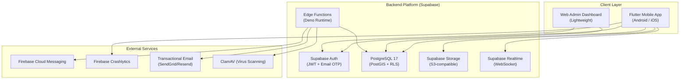
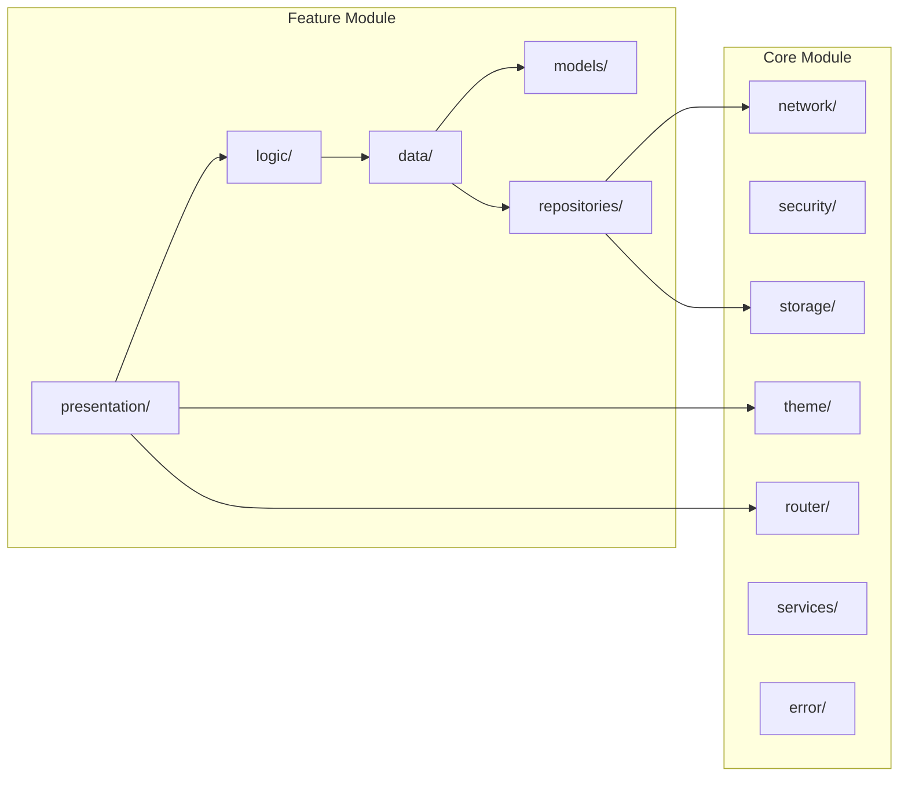
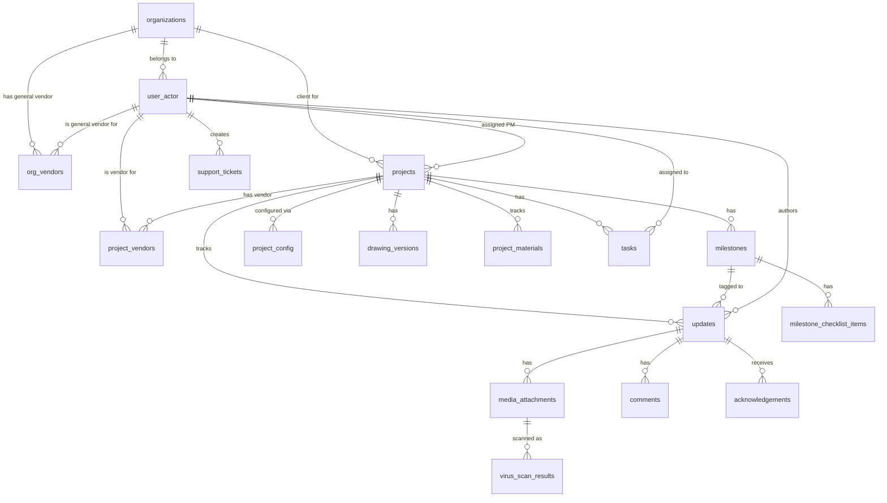

# Setuu — Complete Software Architecture Document

> **Version**: 3.0 &nbsp;|&nbsp; **Date**: August 2026 &nbsp;|&nbsp; **Status**: Reference Architecture
>
> *Seamless Engineering Tracking & User Updates — Construction Progress Platform by Praimo*

---

## 1. Executive Summary

Setuu is a **B2B construction progress tracking platform** enabling Praimo's project managers, employees, and vendors to capture real-time progress updates (photos, videos, documents) from the field and share them with external clients (Rieter, Hitachi, Halliburton) through a structured, auditable system. The architecture is designed for:

- **Mobile-first** field usage under poor connectivity (offline-capable)
- **Invite-only** multi-tenant environment with strict data isolation
- **Media-heavy** workflows (camera-first UX, auto-compression, resumable uploads, virus scanning)
- **Rich Documentation** (in-app drawing viewers with annotations, automated PDF generation)
- **Scalable** to 10,000 users across 100 organizations



---

## 2. User Roles & Access Matrix

Six primary roles drive the entire RBAC system, mapped to the `user_actor` table:

| Role | Description | Data Access | Key Actions |
| ------ | ------------- | ------------- | ------------- |
| **Super Admin** | App Owner/Developer | Platform Settings | Manage subscriptions and platform health. No access to org details, project data, or confidential files to strictly respect privacy policies. |
| **Admin** | Praimo leadership | Full system access | Create projects, invite users, manage orgs, view audit logs, see contract values |
| **Project Manager (PM)** | Field leads | Assigned projects only | Create updates, upload media, manage milestones, checklists, and drawings |
| **Employee** | Field workers and engineers | All projects via RLS | Create updates, log timesheets, view CAD, team docs |
| **Vendor** | Suppliers / Subcontractors | Assigned projects / Org materials | Update assigned materials, delivery logistics, invoicing, defects |
| **Client** | External stakeholders | Their org's projects only | View updates, acknowledge/discuss, download documents, comment |

> [!IMPORTANT]
> Contract values (`projects.contract_value`) are **Admin-only** — never exposed to PM, Employee, Vendor, or Client roles via RLS policies.
> To strictly respect privacy policies and terms and conditions, **Super Admins do not have access to view details about admin/client organizations or their projects**.

---

## 3. System Architecture

### 3.1 High-Level Architecture Pattern

```
┌──────────────────────────────────────────────────────────────────┐
│                        FLUTTER CLIENT                            │
│  ┌─────────────────────────────────────────────────────────────┐ │
│  │  Presentation Layer (Screens, Widgets, GoRouter)            │ │
│  │         ↕ watches/reads                                     │ │
│  │  Logic Layer (Riverpod Providers, StateNotifiers)           │ │
│  │         ↕ calls                                             │ │
│  │  Data Layer (Repositories, Models, API Client)              │ │
│  │         ↕                        ↕                          │ │
│  │  ┌──────────────┐    ┌───────────────────┐                  │ │
│  │  │ Supabase SDK │    │ Hive (Offline)    │                  │ │
│  │  │ (Online)     │    │ + WorkManager     │                  │ │
│  │  └──────┬───────┘    └────────┬──────────┘                  │ │
│  └─────────┼─────────────────────┼──────────────────────────── │ │
│            │                     │                              │ │
└────────────┼─────────────────────┼──────────────────────────────┘
             │                     │
    ┌────────▼─────────────────────▼────────┐
    │         SUPABASE PLATFORM             │
    │  ┌──────────┐  ┌─────────────────┐    │
    │  │   Auth   │  │  PostgreSQL 17  │    │
    │  │(JWT+OTP) │  │  (RLS + PostGIS)│    │
    │  └──────────┘  └─────────────────┘    │
    │  ┌──────────┐  ┌─────────────────┐    │
    │  │ Storage  │  │   Edge Funcs    │    │
    │  │(S3/R2)   │  │   (Deno)       │    │
    │  └──────────┘  └─────────────────┘    │
    │  ┌───────────────────────────────┐    │
    │  │       Realtime (WebSocket)    │    │
    │  └───────────────────────────────┘    │
    └───────────────────────────────────────┘
```

### 3.2 Architecture Pattern: Feature-First Clean Architecture + Riverpod

The Flutter app uses a **feature-first modular architecture** with clean layer separation:



---

## 4. Flutter Client Architecture

### 4.1 Directory Structure

```
lib/
├── main.dart                          # App entry point, initialization chain
├── core/                              # Shared infrastructure
│   ├── injection.dart                 # Riverpod DI providers
│   ├── error/                         # GlobalErrorBoundary, Crashlytics
│   ├── network/                       # Connectivity monitoring
│   ├── router/                        # GoRouter config with auth-based redirects
│   ├── security/                      # SSL certificate pinning
│   ├── services/                      # Location, Media, Notification, Speech
│   ├── storage/                       # Hive box management
│   ├── theme/                         # Material 3 theme
│   └── utils/                         # Constants, validators, formatters
│
└── features/                          # Feature modules
    ├── admin/                         # User/Org management, Audit logs
    ├── auth/                          # Authentication, Login, OTP
    ├── dashboard/                     # Role-specific home screens
    ├── feature_modules/               # Advanced tracking (Materials, Issues, etc.)
    ├── notifications/                 # Push & in-app notifications
    ├── organizations/                 # Org details, subscriptions, limits
    ├── pdf_export/                    # Automated PDF Reporting Engine
    ├── projects/                      # Projects, Milestones, Checklists, Drawings
    ├── search/                        # Global & project-specific search
    ├── settings/                      # Preferences, Support Tickets, Profile
    ├── super_admin/                   # Platform administration & billing
    ├── tasks/                         # Task management and assignments
    ├── timesheets/                    # Labor tracking & timesheets
    ├── updates/                       # Progress updates, media sync queue
    ├── vendor/                        # Vendor-specific materials, invoicing & assignments
    └── wiki/                          # Team docs and wiki
```

### 4.2 State Management & Offline Architecture

The app uses **Riverpod** and **Hive + WorkManager** for robust offline-first capabilities.

- **Optimistic UI Updates**: Core repositories (e.g. Tasks, Materials) immediately update the local Hive cache when a mutation occurs offline, allowing the UI to react instantly.
- **Generic Sync Queue**: Mutations are serialized into a generalized `SyncOperation` model (`table`, `type`, `payload`, `recordId`) and stored in a Hive `sync_queue`.
- **Background Sync**: A background task (via `workmanager` and `callbackDispatcher`) monitors connectivity and processes the queue through a dedicated `SyncService`, pushing changes to Supabase when online. Resumable uploads are supported for large media files.

### 4.3 Design System & Visual Architecture

The application implements a strict Material 3-inspired architecture with Light and Dark mode parity:
- **Design Tokens**: Complete semantic mapping where dark mode isn't just an inversion, but carefully calibrated for architectural environments (e.g., inverting primary from deep navy to soft blue).
- **8-Tone Semantic Colors**: Standardized semantic statuses (Neutral, Active, Warning, Success, Finalization, Verification, Attention, Emergency). Dark mode uses 15% opacity fills for subtle glowing surfaces.
- **Elevation System**: Multi-level elevation using flat colors (L0), cards with subtle borders (L1), glassmorphism with blurs (L2), and scrims with deep shadows (L3).

---

## 5. Backend Architecture (Supabase)

### 5.1 Database Schema (PostgreSQL 17 + PostGIS)



### 5.2 Core Entities

**`organizations`**

- `id`, `name`, `type`, `created_at`
- **New**: `max_projects`, `subscription_tier`, `status` (active, suspended)

**`user_actor`**

- `id`, `role`, `organization_id`, `created_at`
- **Roles**: `super_admin`, `admin`, `pm`, `employee`, `vendor`, `client`
- **New**: `display_name`, `bio`, `avatar_url`, `is_active`, `failed_login_attempts`, `lockout_until`

**Vendors & Access Management**

- **`project_vendors`**: Junction table linking `user_actor` (Vendor) to `projects` for project-centric access.
- **`org_vendors`**: Junction table linking `user_actor` (General Vendor) to `organizations` for broad material supply.

**`projects`**

- `id`, `name`, `description`, `status`, `type`, `contract_value`, `start_date`, `created_at`
- **New**: `client_org_id`, `assigned_pm_id`, `client_visibility`, `po_reference`, `target_date`, `is_archived`, `tags`

**`updates`**

- `id`, `project_id`, `milestone_id`, `author_id`, `caption`, `latitude`, `longitude`, `location_name`, `is_watermarked`, `created_at`
- **New**: `approval_status`

**Platform Administration (New)**

- **`subscription_tiers`**: Defines `tier_name`, `max_storage_gb`, `max_projects`.
- **`platform_settings`**: Global toggles for `maintenance_mode`, `min_app_version`, `global_announcement`.
- **`break_glass_logs`**: Immutable audit table tracking `super_admin_id`, `target_org_id`, `reason`, `timestamp` when privacy is overridden.

**Security & File Integrity Tables**

- **`duplicate_files`**: Tracks original and duplicate files via `similarity_score`.
- **`virus_scan_results`**: Links to `file_id`, flags `is_clean` and `threats_found`.
- **`support_tickets`**: Tracks user-reported issues with `priority`, `title`, `status`, `resolution_notes`, and `updated_at`.
- **`audit_log`**: Records all `INSERT`, `UPDATE`, `DELETE` operations.

### 5.3 Extended Feature Tables (Phase 7)

| Table | Purpose |
| ------- | --------- |
| `project_materials` | Material tracking. Includes `vendor_id` to assign procurement tracking to a specific supplier. |
| `project_issues` | Issue & blocker tracking with severity |
| `change_requests` | Change request management with cost/time impact |
| `project_resources` | Resource allocation with productivity scores |
| `client_approvals` | Client approval records with document links |
| `lessons_learned` | Lessons learned repository |
| `project_handovers` | Handover packages with warranty tracking |
| `client_meetings` | Client meeting management with action items |
| `tasks` | Task management, assignments, and status tracking |
| `timesheets` | Labor and timesheet tracking per user per project |
| `invoices` | Vendor invoicing tracking |
| `wiki_docs` | Team knowledge base and SOPs |

### 5.4 Row Level Security (RLS) Architecture

Every table has RLS enabled. The security model cascades from `user_actor.role`:

| Table | SELECT | INSERT | UPDATE/DELETE |
| ------- | -------- | -------- | --------------- |
| `projects` | Vendor: linked via `project_vendors` or `org_vendors`. PM: `assigned_pm_id = uid()`. Client: `client_org_id = user.org_id`. Employee: `is_employee()`. Admin: all | Admin only | Admin only |
| `updates` | Vendor: own updates only. Others: project visibility. Super Admin: No access. | PM/Employee/Vendor: own projects | Author or Admin |
| `project_materials` | Vendor: `vendor_id = auth.uid()` | PM/Admin | Vendor (assigned), PM, Admin |
| `user_actor` | Super Admin: All profiles. Admin: All profiles. Others: Own profile. | — | Super Admin/Admin |
| `organizations` | Super Admin: Billing/Sub details only. Admin: All. Others: Own org. | Super Admin/Admin | Super Admin/Admin |
| `audit_log` | Super Admin/Admin only | Trigger only | Never |

### 5.5 Database Triggers & Functions

| Trigger/Function | Purpose |
| --------- | ----------- |
| `handle_new_user()` | Auto-create `user_actor` row on signup |
| `log_audit_event()` | Record INSERT/UPDATE/DELETE to `audit_log` with old/new JSONB payloads |
| Audit triggers | Attached to all core and feature tables to fire `log_audit_event()` |

---

## 6. Supabase Edge Functions

### 6.1 `invite-user`

Allows Admins to invite users via email. Enforces role validation. (Super Admins do not manage org-level users).

### 6.2 `send-push`

Dispatches FCM push notifications for new updates, comments, mentions, and milestones.

### 6.3 `force_logout`

Allows Admin to invalidate a user's session for security purposes within their org.

### 6.4 `virus_scan`

Automatically triggers on file uploads (S3 webhooks). Uses ClamAV to verify if `is_clean`. Records output to `virus_scan_results`.

### 6.5 `break_glass_notify`

Automatically triggers when a Super Admin invokes break-glass access. Dispatches a mandatory security alert email to the affected organization's Admin explaining exactly what the developer accessed and why.

---

## 7. Security Architecture

| Layer | Mechanism |
| ------- | ----------- |
| **Transport** | TLS 1.2+ (all traffic) + SSL Certificate Pinning |
| **Authentication** | Email/Password → OTP (new device) → JWT. Biometric fallback using secure local keystores (`flutter_secure_storage` & `local_auth`). |
| **Brute-Force Protection** | Account lockout via `failed_login_attempts` tracking; 15-minute cooldown. |
| **Authorization** | Server-side RBAC via strict RLS policies on every table. |
| **Data Isolation** | Organizations are strongly isolated via `client_org_id` filters in RLS. |
| **Confidentiality** | Super Admin privacy limits restrict access to sensitive user communications/media. |
| **File Access** | Signed time-limited URLs (15 min) for storage buckets. |
| **Audit Trail** | Every DB mutation logged to `audit_log`. |

---

## 8. Dashboard & Analytics Architecture

- **Super Admin Dashboard**: Platform-wide health metrics (e.g., API uptime), active subscriptions, and **storage usage analytics**. Storage usage is broken down per Admin (organization) and roles under the Admin, providing billing insights without exposing the underlying confidential content.
- **Admin Dashboard**: Total active projects, aggregate contract values, active PMs/Clients, overdue projects, support tickets.
- **PM Dashboard**: Assigned projects, pending updates, milestone tracking, open checklists, drawings.
- **Vendor Dashboard**: Assigned projects/materials, pending material deliveries, scoped overdue tasks.
- **Client Dashboard**: Projects assigned to their org, recent updates, pending approvals, handovers.

---

## 9. Migration Reference

The database structure is built iteratively. Key migrations include:

- `001_rls_policies.sql` to `008_feature_modules.sql`: Core functionality, audits, media, collaboration, and feature modules.
- `20260803114000_virus_scan_webhook.sql`: Virus scanning hooks.
- `20260804144500_add_employee_role.sql`: Introduces the Employee role.
- `20260806000000_milestone_checklists.sql`: Adds milestone checklists.
- `20260806000100_drawing_versions.sql`: Adds engineering drawing versioning.
- `20260806000200_project_config.sql`: Modular toggles per project.
- `20260807114500_account_lockout.sql`: Brute force and lockout protection.
- `20260807115000_user_profile_fields.sql`: Enriches `user_actor` profile logic.
- `20260808000000_complete_missing_schema.sql`: Stabilizes all relationships and constraints.
